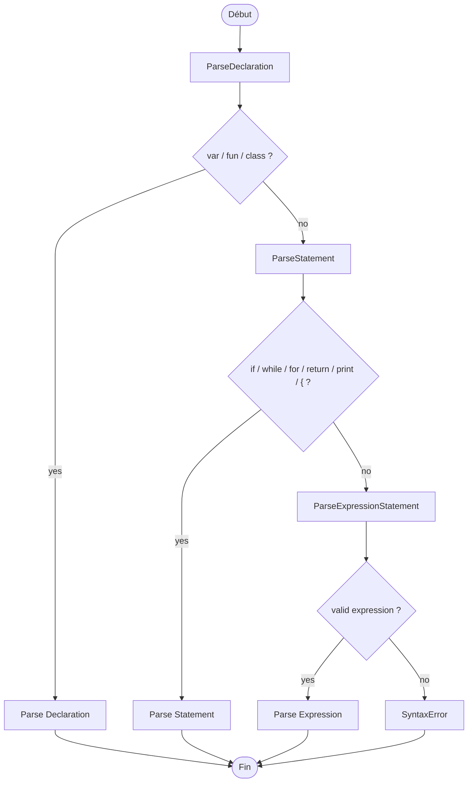

# le-compilateur

An educational compiler project focused on learning language design and compiler architecture.

# Lox Grammar

## Rules for the parser

| Family       | Examples                                |
| ------------ | --------------------------------------- |
| Expressions  | 2 + 3, x = 5, foo(), true               |
| Statements   | print, if, while, for, return, blocs {} |
| Declarations | var, fun, class                         |

---

### Expressions

> Precedence rules — form the main call chain of the parser.
> Level 1 = lowest precedence. Level 11 = highest precedence.

| Level | Rule                 | Operator                       |
| ----- | -------------------- | ------------------------------ |
| 1     | Expression           | → assignment (**start-symbol**)|
| 2     | AssignmentExpression | =                              |
| 3     | OrExpression         | or                             |
| 4     | AndExpression        | and                            |
| 5     | EqualityExpression   | == !=                          |
| 6     | ComparisonExpression | < > <= >=                      |
| 7     | TermExpression       | + -                            |
| 8     | FactorExpression     | * /                            |
| 9     | UnaryExpression      | ! -                            |
| 10    | CallExpression       | () .                           |
| 11    | PrimaryExpression    | literals, identifiers, (expr)  |

#### Structural Sub-rules of Expressions

> Not chained — called punctually from a single parent rule.

| Rule      | Called from    | Role                             |
| --------- | -------------- | -------------------------------- |
| Arguments | CallExpression | argument list `foo(a, b)`        |

#### Precedence Chain (BNF)

```
expression → assignment
assignment → ( call "." )? identifier "=" assignment | or
or         → and ( "or" and )*
and        → equality ( "and" equality )*
equality   → comparison ( ( "!=" | "==" ) comparison )*
comparison → term ( ( ">" | ">=" | "<" | "<=" ) term )*
term       → factor ( ( "-" | "+" ) factor )*
factor     → unary ( ( "/" | "*" ) unary )*
unary      → ( "!" | "-" ) unary | call
call       → primary ( "(" arguments? ")" | "." identifier )*
primary    → NUMBER | STRING | "true" | "false" | "nil"
           | "(" expression ")" | identifier

arguments  → expression ( "," expression )*
```

---

### Statements

> Control flow rules — no precedence ordering among them.
> All called from `ParseStatement`, itself called from `ParseDeclaration`.

| Statement           | Syntax                                          |
| ------------------- | ----------------------------------------------- |
| ExpressionStatement | expression ;                                    |
| PrintStatement      | print expression ;                              |
| IfStatement         | if ( expression ) statement ( else statement )? |
| WhileStatement      | while ( expression ) statement                  |
| ForStatement        | for ( init ; condition ; increment ) statement  |
| ReturnStatement     | return expression? ;                            |

#### Structural Sub-rules of Statements

> Not chained — called punctually from one or more parent rules.

| Rule           | Called from                                            | Role               |
| -------------- | ------------------------------------------------------ | ------------------ |
| BlockStatement | IfStatement, WhileStatement, ForStatement, FunDeclaration | `{ declaration* }` |

---

### Declarations

> Top-level rules — actual entry point of the parser via `ParseDeclaration`.
> Encompass statements and expressions.

| Declaration      | Syntax                                            |
| ---------------- | ------------------------------------------------- |
| VarDeclaration   | var identifier ( = expression )? ;                |
| FunDeclaration   | fun identifier ( params? ) block                  |
| ClassDeclaration | class identifier ( < identifier )? { function\* } |

#### Structural Sub-rules of Declarations

> Not chained — called punctually from a single parent rule.

| Rule       | Called from      | Role                                  |
| ---------- | ---------------- | ------------------------------------- |
| Parameters | FunDeclaration   | parameter list `fun foo(a, b)`        |
| Function   | ClassDeclaration | method body inside a class definition |

