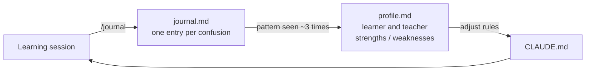

# le-compilateur

A [Lox](https://craftinginterpreters.com/) interpreter written in C#, built as a deliberate learning project in compiler construction.

The goal is less the interpreter itself than the mental models behind it: knowing when a problem calls for lexing, parsing, tree traversal or scope resolution, and applying those techniques to DSLs, query languages, configuration systems and static analysis tools.

The project is also an experiment in **using an AI assistant as a tutor rather than a code generator**.

## Progress

| Phase | Status |
| --- | --- |
| Lexical analysis (tokens, maximal munch, literals, comments) | ✅ Done |
| Syntax analysis (recursive descent, precedence climbing, AST) | ✅ Done |
| Semantic analysis (resolver, scopes, variable binding) | 🚧 In progress |
| Interpretation (environments, closures, classes) | ⏳ Planned |

## AI as a tutor, not a code generator

The project uses [Claude Code](https://claude.com/claude-code), configured through [`CLAUDE.md`](CLAUDE.md) to act as a **Socratic professor of compiler construction**.

All compiler code is written by me. The AI never writes compiler logic: this is enforced as a hard constraint in [`CLAUDE.md`](CLAUDE.md). Its role is limited to tutoring, reviewing my code, and tedious mechanical edits such as renaming test methods.

### Teaching rules

The rules in `CLAUDE.md` separate the kinds of questions a learner asks, because each one calls for a different response:

| Situation | Behaviour |
| --- | --- |
| Design decision or debugging | Socratic: one diagnostic question at a time, no solution, no code |
| Theory question ("what is…", "explain…") | Direct, complete answer, no exercise in disguise |
| Checking one's own understanding ("so this means…") | Explicit verdict first (*correct / partially correct / incorrect*), then one targeted question on the gap |
| Implementation mistake | Suggest a test that exposes the misunderstanding |
| Naming, spelling, terminology | Corrected immediately |

The configuration also pitches explanations at an experienced engineer encountering compiler theory for the first time, and links each concept to production compilers (Roslyn, LLVM, V8) and to everyday engineering.

### Metacognitive feedback loop

Rules written up front are only a first guess. A learning journal records where understanding breaks down, and why, so the teaching can be adjusted from evidence.


```mermaid
graph LR
    Session[Learning session] -->|/journal| Journal[journal.md<br/>one entry per confusion]
    Journal -->|pattern seen ~3 times| Profile[profile.md<br/>learner and teacher<br/>strengths / weaknesses]
    Profile -->|adjust rules| Prompt[CLAUDE.md]
    Prompt --> Session
```

Each journal entry records the confusion, the quote that revealed it, the cause (learner, teacher, or both), what unblocked it, and its status (resolved / fragile / open). The teacher's mistakes are logged too: ambiguous wording, Socratic loops that go nowhere, answers that drift off scope.

The journal itself lives in `.learning/` and is kept private (git-ignored). The method is public, the content is not.

### Files

- [`CLAUDE.md`](CLAUDE.md): the tutor's configuration and teaching rules.
- [`.claude/skills/journal/`](.claude/skills/journal/SKILL.md): the `/journal` command that appends entries and updates the profile.
- `.docs/`: theory write-ups exported from tutoring sessions, such as the [Lox grammar](.docs/lox-grammar.md).

### Reusing this setup

1. Clone the repository and install [Claude Code](https://claude.com/claude-code).
2. Edit the *Project Context* and *Progression Map* sections of `CLAUDE.md` for your own topic and language.
3. Work through the material, asking questions as you go.
4. Run `/journal` before clearing or ending a session.

The longer-term aim is to distil the journal into a generic prompt template, where only the topic to learn needs to be filled in.

## Architecture

```
src/
├── Compilateur.Core/
│   ├── Lexical/      # scanner: source text → tokens
│   ├── Syntactic/    # recursive-descent parsers → AST nodes
│   ├── Semantic/     # resolver: static scope resolution
│   └── Errors/
└── Compilateur.Tests/
    ├── Lexical/
    ├── Syntactic/
    └── Integration/
```

Pipeline: `source → Lexer → tokens → Parser → AST → Resolver → Interpreter`.

The grammar and parser rule hierarchy are documented in [`.docs/lox-grammar.md`](.docs/lox-grammar.md).

## Build and test

Requires the .NET 10 SDK.

```bash
dotnet build
dotnet test
```

## References

- Robert Nystrom, [*Crafting Interpreters*](https://craftinginterpreters.com/)
